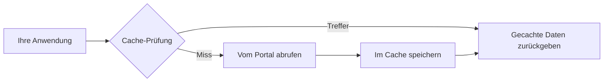

# Caching

Das Handelsregister-Package enthält ein intelligentes Caching-System, um die Last auf dem Registerportal zu reduzieren und die Leistung zu verbessern.

## Übersicht



### Standardverhalten

- **Cache aktiviert** standardmäßig
- **TTL (Time-To-Live):** 24 Stunden
- **Speicherort:** `~/.cache/handelsregister/`
- **Format:** JSON-Dateien

---

## Cache verwenden

### Automatisches Caching

Caching funktioniert automatisch:

```python
from handelsregister import search

# Erster Aufruf: Ruft vom Portal ab, speichert im Cache
ergebnisse1 = search("Deutsche Bank")

# Zweiter Aufruf: Gibt gecachte Daten zurück (schneller)
ergebnisse2 = search("Deutsche Bank")
```

### Cache umgehen

```python
# Cache für diesen Aufruf überspringen
ergebnisse = search("Deutsche Bank", use_cache=False)
```

### Cache löschen

```python
from handelsregister import clear_cache

# Gesamten Cache löschen
clear_cache()
```

Oder über CLI:

```bash
handelsregister --clear-cache
```

---

## Cache-Konfiguration

### Benutzerdefinierte TTL

```python
from handelsregister import HandelsRegister, SearchCache

# 1-Stunden-Cache
cache = SearchCache(ttl_hours=1)
hr = HandelsRegister(cache=cache)

# 7-Tage-Cache
cache = SearchCache(ttl_hours=168)
hr = HandelsRegister(cache=cache)
```

### Benutzerdefiniertes Cache-Verzeichnis

```python
from handelsregister import SearchCache

cache = SearchCache(
    cache_dir="/pfad/zum/eigenen/cache",
    ttl_hours=24
)
```

Oder über Umgebungsvariable:

```bash
export HANDELSREGISTER_CACHE_DIR=/tmp/hr-cache
```

### Caching deaktivieren

```python
from handelsregister import HandelsRegister

# Kein Caching
hr = HandelsRegister(cache=None)
ergebnisse = hr.search("Bank")
```

---

## Cache-Struktur

Der Cache speichert Daten als JSON-Dateien:

```
~/.cache/handelsregister/
├── searches/
│   ├── a1b2c3d4.json      # Suchergebnisse
│   ├── e5f6g7h8.json
│   └── ...
├── details/
│   ├── HRB_12345_Berlin.json   # Unternehmensdetails
│   ├── HRB_67890_Hamburg.json
│   └── ...
└── meta.json               # Cache-Metadaten
```

### Cache-Key-Generierung

Cache-Keys werden aus Suchparametern generiert:

```python
# Diese erzeugen den gleichen Cache-Key:
search("Bank", states=["BE"])
search("Bank", states=["BE"])

# Diese erzeugen unterschiedliche Cache-Keys:
search("Bank", states=["BE"])
search("Bank", states=["HH"])
search("Bank", states=["BE"], only_active=True)
```

---

## Cache-Eintrags-Format

```json
{
  "timestamp": "2024-01-15T10:30:00Z",
  "ttl_hours": 24,
  "query": {
    "keywords": "Bank",
    "states": ["BE"],
    "register_type": null
  },
  "results": [
    {
      "name": "Deutsche Bank AG",
      "register_court": "Frankfurt am Main",
      "register_num": "HRB 12345",
      "status": "aktuell eingetragen"
    }
  ]
}
```

---

## Cache-Status prüfen

```python
from handelsregister import SearchCache

cache = SearchCache()

# Prüfen ob Eintrag existiert und gültig ist
if cache.has_valid_entry("Bank", states=["BE"]):
    print("Verwende gecachte Daten")
else:
    print("Rufe vom Portal ab")

# Cache-Statistiken abrufen
stats = cache.get_stats()
print(f"Einträge gesamt: {stats['total']}")
print(f"Gültige Einträge: {stats['valid']}")
print(f"Abgelaufene Einträge: {stats['expired']}")
print(f"Cache-Größe: {stats['size_mb']:.2f} MB")
```

---

## Best Practices für Caching

### 1. Standard-Caching verwenden

Für die meisten Anwendungsfälle ist der 24-Stunden-Cache angemessen:

```python
# Einfach search() verwenden - Caching ist automatisch
ergebnisse = search("Bank")
```

### 2. Kürzere TTL für volatile Daten

Wenn Sie aktuelle Daten benötigen (z.B. für rechtliche Verfahren):

```python
cache = SearchCache(ttl_hours=1)  # 1 Stunde
hr = HandelsRegister(cache=cache)
```

### 3. Längere TTL für Analysen

Für historische Analysen, wo Aktualität weniger kritisch ist:

```python
cache = SearchCache(ttl_hours=168)  # 7 Tage
hr = HandelsRegister(cache=cache)
```

### 4. Kein Cache für Einzeloperationen

```python
# Einzelabfrage, kein Caching nötig
ergebnisse = search("Spezifische Firma GmbH", use_cache=False)
```

### 5. Periodische Cache-Bereinigung

```python
from handelsregister import SearchCache

cache = SearchCache()
cache.cleanup_expired()  # Abgelaufene Einträge entfernen
```

---

## Speicherplatz

Der Cache kann über die Zeit wachsen. Überwachen und bei Bedarf bereinigen:

```python
from handelsregister import SearchCache

cache = SearchCache()

# Cache-Größe abrufen
stats = cache.get_stats()
print(f"Cache-Größe: {stats['size_mb']:.2f} MB")

# Abgelaufene Einträge bereinigen
entfernt = cache.cleanup_expired()
print(f"{entfernt} abgelaufene Einträge entfernt")

# Oder alles löschen
cache.clear()
```

---

## Thread-Sicherheit

Der Cache ist thread-sicher für parallelen Zugriff:

```python
from concurrent.futures import ThreadPoolExecutor
from handelsregister import search

suchbegriffe = ["Bank", "Versicherung", "AG", "GmbH"]

with ThreadPoolExecutor(max_workers=4) as executor:
    ergebnisse = list(executor.map(search, suchbegriffe))
```

---

## Siehe auch

- [API-Referenz: SearchCache](../api/classes.md) – Technische Details
- [Als Library verwenden](library.md) – Allgemeine Library-Verwendung
- [CLI-Optionen](cli.md) – Cache-bezogene CLI-Optionen

