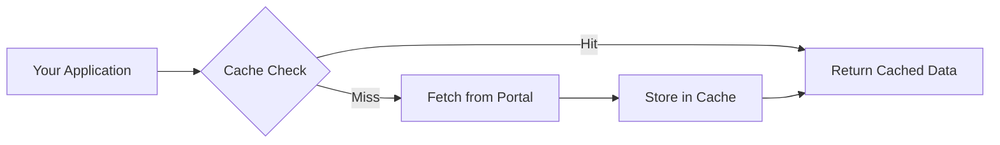

# Caching

The Handelsregister package includes an intelligent caching system to reduce load on the register portal and improve performance.

## Overview



### Default Behavior

- **Cache enabled** by default
- **TTL (Time-To-Live):** 24 hours
- **Location:** `~/.cache/handelsregister/`
- **Format:** JSON files

---

## Using the Cache

### Automatic Caching

Caching works automatically:

```python
from handelsregister import search

# First call: fetches from portal, stores in cache
results1 = search("Deutsche Bank")

# Second call: returns cached data (faster)
results2 = search("Deutsche Bank")
```

### Bypassing the Cache

```python
# Skip cache for this call
results = search("Deutsche Bank", use_cache=False)
```

### Clearing the Cache

```python
from handelsregister import clear_cache

# Clear entire cache
clear_cache()
```

Or via CLI:

```bash
handelsregister --clear-cache
```

---

## Cache Configuration

### Custom TTL

```python
from handelsregister import HandelsRegister, SearchCache

# 1-hour cache
cache = SearchCache(ttl_hours=1)
hr = HandelsRegister(cache=cache)

# 7-day cache
cache = SearchCache(ttl_hours=168)
hr = HandelsRegister(cache=cache)
```

### Custom Cache Directory

```python
from handelsregister import SearchCache

cache = SearchCache(
    cache_dir="/path/to/custom/cache",
    ttl_hours=24
)
```

Or via environment variable:

```bash
export HANDELSREGISTER_CACHE_DIR=/tmp/hr-cache
```

### Disable Caching

```python
from handelsregister import HandelsRegister

# No caching at all
hr = HandelsRegister(cache=None)
results = hr.search("Bank")
```

---

## Cache Structure

The cache stores data as JSON files:

```
~/.cache/handelsregister/
├── searches/
│   ├── a1b2c3d4.json      # Search results
│   ├── e5f6g7h8.json
│   └── ...
├── details/
│   ├── HRB_12345_Berlin.json   # Company details
│   ├── HRB_67890_Hamburg.json
│   └── ...
└── meta.json               # Cache metadata
```

### Cache Key Generation

Cache keys are generated from search parameters:

```python
# These create the same cache key:
search("Bank", states=["BE"])
search("Bank", states=["BE"])

# These create different cache keys:
search("Bank", states=["BE"])
search("Bank", states=["HH"])
search("Bank", states=["BE"], only_active=True)
```

---

## Cache Entry Format

```json
{
  "timestamp": "2024-01-15T10:30:00Z",
  "ttl_hours": 24,
  "query": {
    "keywords": "Bank",
    "states": ["BE"],
    "register_type": null
  },
  "results": [
    {
      "name": "Deutsche Bank AG",
      "register_court": "Frankfurt am Main",
      "register_num": "HRB 12345",
      "status": "currently registered"
    }
  ]
}
```

---

## Checking Cache Status

```python
from handelsregister import SearchCache

cache = SearchCache()

# Check if entry exists and is valid
if cache.has_valid_entry("Bank", states=["BE"]):
    print("Using cached data")
else:
    print("Will fetch from portal")

# Get cache statistics
stats = cache.get_stats()
print(f"Total entries: {stats['total']}")
print(f"Valid entries: {stats['valid']}")
print(f"Expired entries: {stats['expired']}")
print(f"Cache size: {stats['size_mb']:.2f} MB")
```

---

## Cache Best Practices

### 1. Use Default Caching

For most use cases, the default 24-hour cache is appropriate:

```python
# Just use search() - caching is automatic
results = search("Bank")
```

### 2. Shorter TTL for Volatile Data

If you need current data (e.g., for legal processes):

```python
cache = SearchCache(ttl_hours=1)  # 1 hour
hr = HandelsRegister(cache=cache)
```

### 3. Longer TTL for Analysis

For historical analysis where freshness is less critical:

```python
cache = SearchCache(ttl_hours=168)  # 7 days
hr = HandelsRegister(cache=cache)
```

### 4. No Cache for One-Time Operations

```python
# Single query, no need to cache
results = search("Specific Company GmbH", use_cache=False)
```

### 5. Periodic Cache Cleanup

```python
from handelsregister import SearchCache

cache = SearchCache()
cache.cleanup_expired()  # Remove expired entries
```

---

## Disk Space

The cache can grow over time. Monitor and clean as needed:

```python
from handelsregister import SearchCache

cache = SearchCache()

# Get cache size
stats = cache.get_stats()
print(f"Cache size: {stats['size_mb']:.2f} MB")

# Clean expired entries
removed = cache.cleanup_expired()
print(f"Removed {removed} expired entries")

# Or clear everything
cache.clear()
```

---

## Thread Safety

The cache is thread-safe for concurrent access:

```python
from concurrent.futures import ThreadPoolExecutor
from handelsregister import search

keywords = ["Bank", "Versicherung", "AG", "GmbH"]

with ThreadPoolExecutor(max_workers=4) as executor:
    results = list(executor.map(search, keywords))
```

---

## See Also

- [API Reference: SearchCache](../api/classes.md) – Technical details
- [Using as Library](library.md) – General library usage
- [CLI Options](cli.md) – Cache-related CLI options

