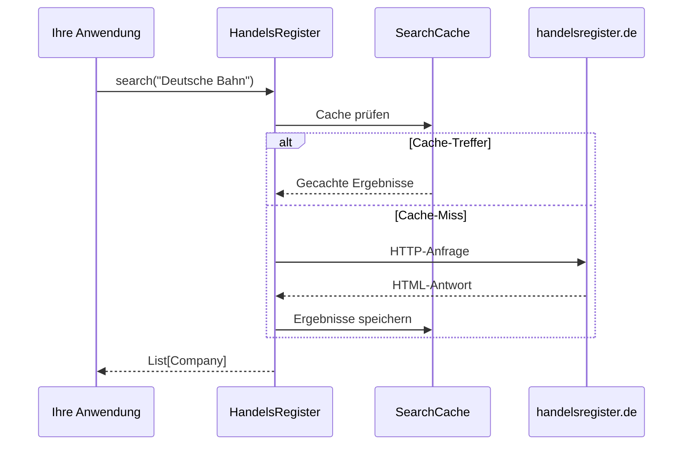

# Benutzerhandbuch

Willkommen zum umfassenden Benutzerhandbuch für das Handelsregister-Package. Dieses Handbuch behandelt alle Funktionen im Detail.

## Übersicht

Das Handelsregister-Package bietet zwei Hauptwege zur Abfrage des deutschen Handelsregisters:

1. **Als Python-Library** – Für die Integration in Ihre Anwendungen
2. **Als CLI-Tool** – Für schnelle Kommandozeilen-Abfragen

---

## Kapitel

<div class="grid cards" markdown>

-   :material-code-braces:{ .lg .middle } __Als Library verwenden__

    ---

    Lernen Sie, wie Sie Handelsregister als Python-Library in Ihren Anwendungen verwenden.

    [:octicons-arrow-right-24: Library-Anleitung](library.md)

-   :material-console:{ .lg .middle } __Kommandozeile (CLI)__

    ---

    Nutzen Sie die Kommandozeilen-Schnittstelle für schnelle Abfragen und Scripting.

    [:octicons-arrow-right-24: CLI-Anleitung](cli.md)

-   :material-file-document-multiple:{ .lg .middle } __Details abrufen__

    ---

    Wie Sie erweiterte Unternehmensinformationen wie Kapital, Vertreter und mehr abrufen.

    [:octicons-arrow-right-24: Details-Anleitung](details.md)

-   :material-cached:{ .lg .middle } __Caching__

    ---

    Verstehen und konfigurieren Sie den Caching-Mechanismus.

    [:octicons-arrow-right-24: Caching-Anleitung](cache.md)

</div>

---

## Kernkonzepte

### Datenstrukturen

Das Package verwendet mehrere Datenstrukturen:

| Struktur | Beschreibung |
|----------|--------------|
| `Company` | Grundlegende Unternehmensinformationen aus Suchergebnissen |
| `CompanyDetails` | Erweiterte Informationen (Kapital, Vertreter, etc.) |
| `Address` | Strukturierte Adressdaten |
| `Representative` | Geschäftsführer, Vorstandsmitglieder, etc. |
| `Owner` | Gesellschafter (bei Personengesellschaften) |

### Suchablauf



### Rate Limiting

!!! warning "Wichtig"
    Das Registerportal erlaubt maximal **60 Anfragen pro Stunde**. Das Package erzwingt dieses Limit nicht automatisch, daher sind Sie selbst dafür verantwortlich, innerhalb dieser Grenzen zu bleiben.

---

## Schnellreferenz

### Häufigste Operationen

=== "Suche"

    ```python
    from handelsregister import search
    
    # Einfache Suche
    firmen = search("Deutsche Bahn")
    
    # Mit Filtern
    firmen = search(
        keywords="Bank",
        states=["BE", "HH"],
        register_type="HRB",
        include_deleted=False
    )
    ```

=== "Details abrufen"

    ```python
    from handelsregister import search, get_details
    
    firmen = search("GASAG AG", keyword_option="exact")
    if firmen:
        details = get_details(firmen[0])
        print(details.capital)
        print(details.representatives)
    ```

=== "CLI"

    ```bash
    # Suche
    handelsregister -s "Deutsche Bahn"
    
    # Mit Filtern und JSON-Ausgabe
    handelsregister -s "Bank" --states BE,HH --json
    
    # Mit Details
    handelsregister -s "GASAG AG" --exact --details
    ```

---

## Siehe auch

- [API-Referenz](../api/index.md) – Technische Dokumentation
- [Beispiele](../examples/simple.md) – Praktische Code-Beispiele
- [Referenztabellen](../reference/states.md) – Bundesländer-Codes, Registerarten, etc.

