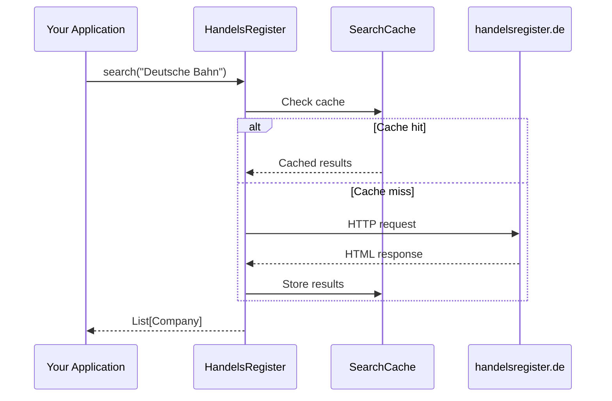

# User Guide

Welcome to the comprehensive user guide for the Handelsregister package. This guide covers all functionality in detail.

## Overview

The Handelsregister package provides two main ways to query the German commercial register:

1. **As a Python Library** – For integration into your applications
2. **As a CLI Tool** – For quick command-line queries

---

## Chapters

<div class="grid cards" markdown>

-   :material-code-braces:{ .lg .middle } __Using as Library__

    ---

    Learn how to use Handelsregister as a Python library in your applications.

    [:octicons-arrow-right-24: Library Guide](library.md)

-   :material-console:{ .lg .middle } __Command Line (CLI)__

    ---

    Use the command-line interface for quick queries and scripting.

    [:octicons-arrow-right-24: CLI Guide](cli.md)

-   :material-file-document-multiple:{ .lg .middle } __Fetching Details__

    ---

    How to retrieve extended company information like capital, representatives, and more.

    [:octicons-arrow-right-24: Details Guide](details.md)

-   :material-cached:{ .lg .middle } __Caching__

    ---

    Understand and configure the caching mechanism.

    [:octicons-arrow-right-24: Caching Guide](cache.md)

</div>

---

## Core Concepts

### Data Structures

The package uses several data structures:

| Structure | Description |
|-----------|-------------|
| `Company` | Basic company information from search results |
| `CompanyDetails` | Extended information (capital, representatives, etc.) |
| `Address` | Structured address data |
| `Representative` | Managing directors, board members, etc. |
| `Owner` | Shareholders (for partnerships) |

### Search Flow



### Rate Limiting

!!! warning "Important"
    The register portal allows a maximum of **60 requests per hour**. The package does not automatically enforce this limit, so you are responsible for staying within these bounds.

---

## Quick Reference

### Most Common Operations

=== "Search"

    ```python
    from handelsregister import search
    
    # Simple search
    companies = search("Deutsche Bahn")
    
    # With filters
    companies = search(
        keywords="Bank",
        states=["BE", "HH"],
        register_type="HRB",
        only_active=True
    )
    ```

=== "Get Details"

    ```python
    from handelsregister import search, get_details
    
    companies = search("GASAG AG", exact=True)
    if companies:
        details = get_details(companies[0])
        print(details.capital)
        print(details.representatives)
    ```

=== "CLI"

    ```bash
    # Search
    handelsregister -s "Deutsche Bahn"
    
    # With filters and JSON output
    handelsregister -s "Bank" --states BE,HH --json
    
    # With details
    handelsregister -s "GASAG AG" --exact --details
    ```

---

## See Also

- [API Reference](../api/index.md) – Technical documentation
- [Examples](../examples/simple.md) – Practical code examples
- [Reference Tables](../reference/states.md) – State codes, register types, etc.

