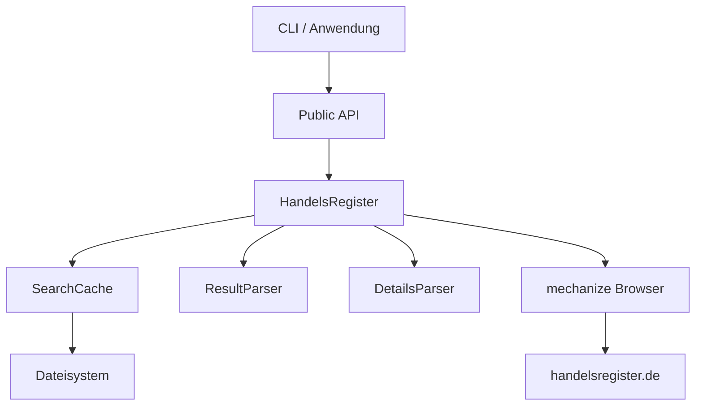

# Handelsregister

<div class="grid cards" markdown>

-   :material-rocket-launch:{ .lg .middle } __Schneller Einstieg__

    ---

    Installieren Sie das Package und starten Sie in wenigen Minuten mit der Abfrage des deutschen Handelsregisters.

    [:octicons-arrow-right-24: Installation](installation.md)

-   :material-code-braces:{ .lg .middle } __Als Library__

    ---

    Integrieren Sie die Handelsregister-Abfrage in Ihre Python-Anwendungen mit einer einfachen API.

    [:octicons-arrow-right-24: Library-Dokumentation](guide/library.md)

-   :material-console:{ .lg .middle } __Kommandozeile__

    ---

    Nutzen Sie das CLI-Tool für schnelle Abfragen direkt aus dem Terminal.

    [:octicons-arrow-right-24: CLI-Dokumentation](guide/cli.md)

-   :material-api:{ .lg .middle } __API-Referenz__

    ---

    Vollständige technische Dokumentation aller Klassen, Funktionen und Datenmodelle.

    [:octicons-arrow-right-24: API-Referenz](api/index.md)

</div>

---

## Was ist Handelsregister?

**Handelsregister** ist ein Python-Package für das gemeinsame Registerportal der deutschen Bundesländer. Es ermöglicht die programmatische Abfrage des Handelsregisters – sowohl als **Kommandozeilen-Tool** als auch als **Library** in eigenen Anwendungen.

```python
from handelsregister import search

# Unternehmen suchen
unternehmen = search("Deutsche Bahn")

for firma in unternehmen:
    print(f"{firma.name} - {firma.register_num}")
```

### Funktionsumfang

- :material-magnify: **Unternehmenssuche** – Suche nach Firmennamen, Registernummer oder Ort
- :material-filter: **Flexible Filter** – Nach Bundesland, Registerart und Status filtern
- :material-file-document: **Detailabruf** – Erweiterte Unternehmensinformationen abrufen
- :material-cached: **Intelligentes Caching** – Automatische Zwischenspeicherung von Ergebnissen
- :material-console: **CLI-Tool** – Kommandozeilen-Interface für schnelle Abfragen
- :material-code-json: **JSON-Export** – Maschinenlesbare Ausgabe für Weiterverarbeitung

---

## Schnellbeispiel

=== "Python"

    ```python
    from handelsregister import search, get_details

    # Suche nach Banken in Berlin und Hamburg
    banken = search(
        keywords="Bank",
        states=["BE", "HH"],
        register_type="HRB"
    )

    print(f"Gefunden: {len(banken)} Unternehmen")

    # Details zum ersten Ergebnis abrufen
    if banken:
        details = get_details(banken[0])
        print(f"Firma: {details.name}")
        print(f"Kapital: {details.capital} {details.currency}")
    ```

=== "Kommandozeile"

    ```bash
    # Einfache Suche
    handelsregister -s "Deutsche Bahn"

    # Mit JSON-Ausgabe
    handelsregister -s "GASAG AG" --exact --json

    # Mit Filtern
    handelsregister -s "Bank" --states BE,HH --register-type HRB
    ```

---

## Installation

Die schnellste Methode zur Installation ist mit [uv](https://docs.astral.sh/uv/):

```bash
# Klonen und installieren
git clone https://github.com/bundesAPI/handelsregister.git
cd handelsregister
uv sync
```

Oder direkt mit pip:

```bash
pip install git+https://github.com/bundesAPI/handelsregister.git
```

:material-arrow-right: [Vollständige Installationsanleitung](installation.md)

---

## Architektur

Das Package besteht aus mehreren Schichten:



| Komponente | Beschreibung |
|------------|--------------|
| `search()` | Einfache API für Unternehmenssuche |
| `get_details()` | API für Detailabruf |
| `HandelsRegister` | Browser-Automatisierung |
| `SearchCache` | TTL-basiertes Caching |
| `ResultParser` | HTML-Parsing der Suchergebnisse |
| `DetailsParser` | Parsing der Detailansichten |

---

## Rechtliche Hinweise

!!! warning "Nutzungsbeschränkungen"

    Es ist unzulässig, mehr als **60 Abrufe pro Stunde** zu tätigen. Das Registerportal ist das Ziel automatisierter Massenabfragen, deren Frequenz häufig die Straftatbestände der **§§ 303a, b StGB** erfüllt.

Die Einsichtnahme in das Handelsregister ist gemäß **§ 9 Abs. 1 HGB** jeder Person zu Informationszwecken gestattet.

:material-arrow-right: [Vollständige rechtliche Hinweise](legal.md)

---

## Unterstützung

<div class="grid cards" markdown>

-   :fontawesome-brands-github:{ .lg .middle } __GitHub Issues__

    ---

    Bugs melden und Features anfragen

    [:octicons-arrow-right-24: Issues öffnen](https://github.com/bundesAPI/handelsregister/issues)

-   :material-source-pull:{ .lg .middle } __Beitragen__

    ---

    Pull Requests sind willkommen!

    [:octicons-arrow-right-24: Repository](https://github.com/bundesAPI/handelsregister)

</div>

---

## Lizenz

Dieses Projekt ist Teil der [bundesAPI](https://github.com/bundesAPI) Initiative und steht unter der MIT-Lizenz.

