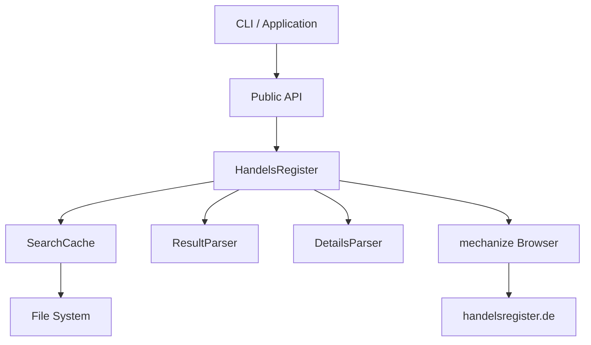

# Handelsregister

<div class="grid cards" markdown>

-   :material-rocket-launch:{ .lg .middle } __Quick Start__

    ---

    Install the package and start querying the German commercial register in minutes.

    [:octicons-arrow-right-24: Installation](installation.md)

-   :material-code-braces:{ .lg .middle } __As Library__

    ---

    Integrate commercial register queries into your Python applications with a simple API.

    [:octicons-arrow-right-24: Library Documentation](guide/library.md)

-   :material-console:{ .lg .middle } __Command Line__

    ---

    Use the CLI tool for quick queries directly from your terminal.

    [:octicons-arrow-right-24: CLI Documentation](guide/cli.md)

-   :material-api:{ .lg .middle } __API Reference__

    ---

    Complete technical documentation of all classes, functions, and data models.

    [:octicons-arrow-right-24: API Reference](api/index.md)

</div>

---

## What is Handelsregister?

**Handelsregister** is a Python package for the shared commercial register portal of the German federal states. It enables programmatic access to the German commercial register – both as a **command-line tool** and as a **library** in your own applications.

```python
from handelsregister import search

# Search for companies
companies = search("Deutsche Bahn")

for company in companies:
    print(f"{company['name']} - {company['register_num']}")
```

### Features

- :material-magnify: **Company Search** – Search by company name, register number, or location
- :material-filter: **Flexible Filters** – Filter by state, register type, and status
- :material-file-document: **Detail Fetching** – Retrieve extended company information
- :material-cached: **Intelligent Caching** – Automatic caching of results
- :material-console: **CLI Tool** – Command-line interface for quick queries
- :material-code-json: **JSON Export** – Machine-readable output for further processing

---

## Quick Example

=== "Python"

    ```python
    from handelsregister import search, get_details

    # Search for banks in Berlin and Hamburg
    banks = search(
        keywords="Bank",
        states=["BE", "HH"],
        register_type="HRB"
    )

    print(f"Found: {len(banks)} companies")

    # Get details for the first result
    if banks:
        details = get_details(banks[0])
        print(f"Company: {details.name}")
        print(f"Capital: {details.capital} {details.currency}")
    ```

=== "Command Line"

    ```bash
    # Simple search
    handelsregister -s "Deutsche Bahn"

    # With JSON output
    handelsregister -s "GASAG AG" --exact --json

    # With filters
    handelsregister -s "Bank" --states BE,HH --register-type HRB
    ```

---

## Installation

The fastest installation method is with [uv](https://docs.astral.sh/uv/):

```bash
# Clone and install
git clone https://github.com/bundesAPI/handelsregister.git
cd handelsregister
uv sync
```

Or directly with pip:

```bash
pip install git+https://github.com/bundesAPI/handelsregister.git
```

:material-arrow-right: [Complete Installation Guide](installation.md)

---

## Architecture

The package consists of several layers:



| Component | Description |
|-----------|-------------|
| `search()` | Simple API for company search |
| `get_details()` | API for fetching details |
| `HandelsRegister` | Browser automation |
| `SearchCache` | TTL-based caching |
| `ResultParser` | HTML parsing of search results |
| `DetailsParser` | Parsing of detail views |

---

## Legal Notice

!!! warning "Usage Restrictions"

    It is not permitted to make more than **60 requests per hour**. The register portal is frequently targeted by automated mass queries, which often constitute criminal offenses under **§§ 303a, b StGB** (German Criminal Code).

Access to the commercial register is permitted for informational purposes according to **§ 9 Abs. 1 HGB** (German Commercial Code).

:material-arrow-right: [Complete Legal Notice](legal.md)

---

## Support

<div class="grid cards" markdown>

-   :fontawesome-brands-github:{ .lg .middle } __GitHub Issues__

    ---

    Report bugs and request features

    [:octicons-arrow-right-24: Open Issues](https://github.com/bundesAPI/handelsregister/issues)

-   :material-source-pull:{ .lg .middle } __Contribute__

    ---

    Pull requests are welcome!

    [:octicons-arrow-right-24: Repository](https://github.com/bundesAPI/handelsregister)

</div>

---

## License

This project is part of the [bundesAPI](https://github.com/bundesAPI) initiative and is licensed under the MIT License.

